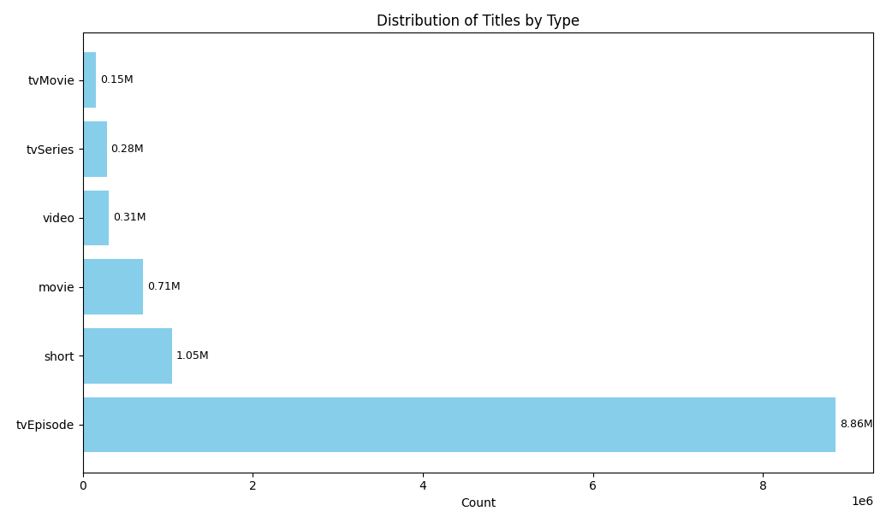
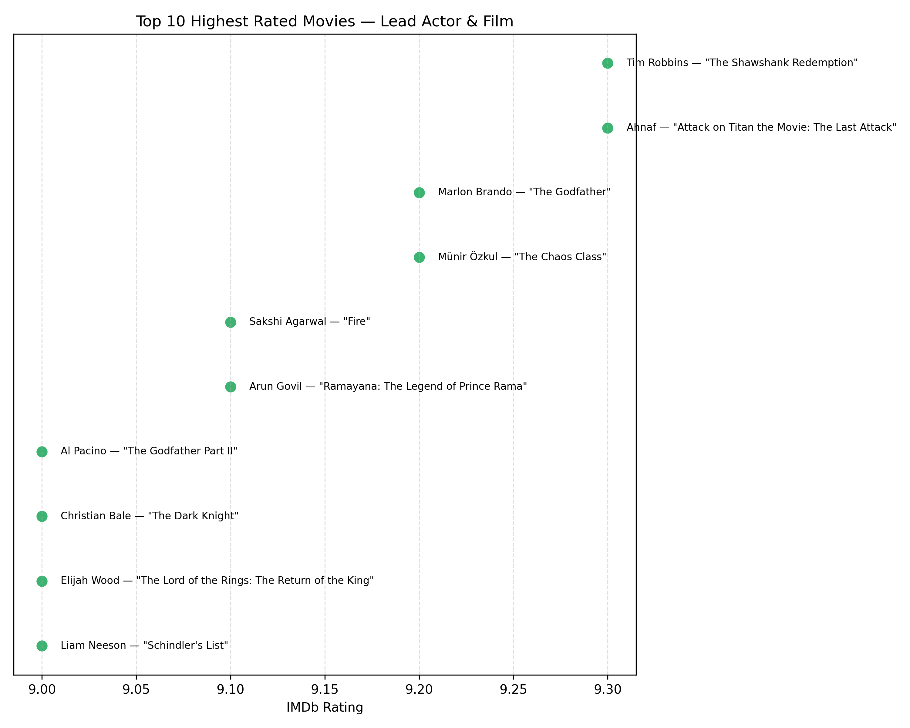
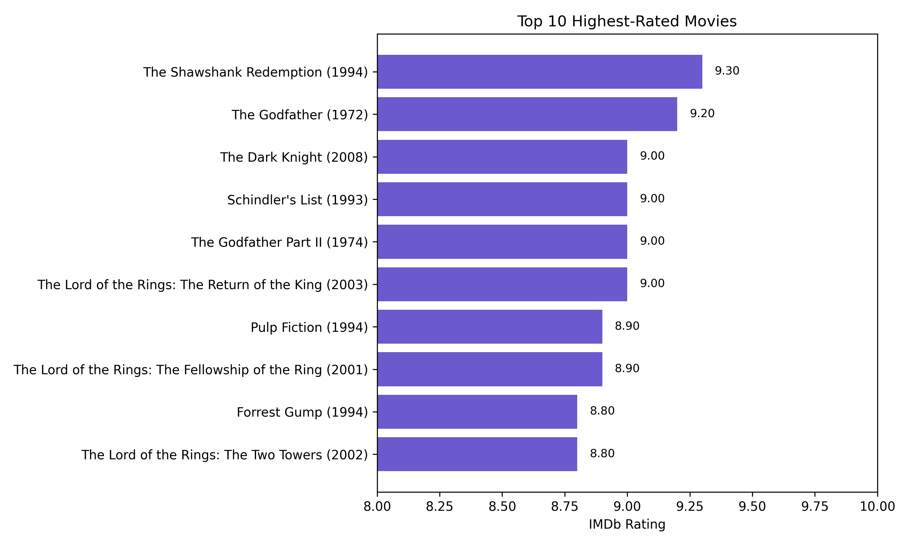

# IMDb Data Analysis
&nbsp; 
## Project Overview 

This project explores trends in the IMDb dataset to better understand what types of content are produced, how audiences rate them, and who the most active or successful contributors are. 
I focus on visualizing key metrics like genre popularity, production volume over time, average ratings, and contributor performance in a clear and approachable way.

&nbsp; 
## Key Objectives
The goal of this project is to extract meaningful insights from the IMDb dataset by answering several key questions:

  - What types of content (e.g. movies, series, episodes) are most common?

  - How has production volume changed over time?

  - Which genres are the most popular and which receive the highest ratings?

  - What is the typical runtime for different types of content?

  - Who are the most active and highest-rated actors and directors?

  - Is there a connection between how popular a title is (number of votes) and how well it's rated?
    
&nbsp;
 ## Data Sources
The analysis is based on IMDb data files manually downloaded from the official [IMDb datasets](https://datasets.imdbws.com/) page and then uploaded to Google BigQuery for querying. 
The following tables were created from the corresponding TSV files:

  - **IMDb_dataset.title_basics → title.basics.tsv**
    
Contains metadata about titles, including type (movie, short, TV episode), primary title, original title, start/end year, runtime, and genres.

  - **IMDb_dataset.title_ratings → title.ratings.tsv**
    
Includes the average IMDb rating and the number of votes each title has received

  - **IMDb_dataset.title_principals → title.principals.tsv**
    
Maps titles to their main cast and crew (actors, actresses, directors, etc.), including their role categories and order of appearance.

  - **IMDb_dataset.name → name.basics.tsv**
    
rovides information about individuals (e.g. actors, directors), including their birth/death years and known titles.

  - **IMDb_dataset.title_crew → title.crew.tsv**
    
 Contains directors and writers for each title, often stored as comma-separated IDs.

 &nbsp; 
## Tools & Technologies
  - **Google BigQuery** for SQL querying large datasets

  - **Python** for data analysis and visualization

  - **Libraries:** pandas, matplotlib, seaborn, numpy, scipy

&nbsp; 
## Key Insights from the Analysis
  - **TV Episodes dominate** the IMDb dataset, far outnumbering other content types due to each episode being counted individually. Short films and full-length movies also represent a significant portion of the database.

  - **Content production has surged** over the past few decades. While earlier decades saw steady output, production dramatically increased starting in the 1990s and peaked in the 2010s—likely driven by the rise of television and streaming platforms.

  - **Runtimes vary significantly** by content type. Video games and feature films have the longest average runtimes, while TV episodes and shorts are considerably shorter, consistent with their formats.

  - **Top genres like Drama, Comedy, and Documentary** dominate both film and TV, but some genres like Reality-TV and Talk-Show appear almost exclusively in series format, reflecting differences in storytelling and audience preferences.

  - **Genres with the highest ratings** (based on well-rated and widely voted content) include Biography, Animation, and Drama, which consistently receive strong viewer feedback.

  - **The most active actors and directors** have worked on hundreds (or even thousands) of titles, often in regional or serialized TV. For example, Matsunosuke Onoe and Johnny Manahan lead their respective categories by volume.

  - **Top-rated performers and directors** include well-established names with high consistency. Directors like Tomohisa Taguchi and actors in high-profile dramas stand out with excellent average ratings across multiple titles.

  - **“Famous” directors** (with a high volume of popular work) tend to have better average ratings than “regular” ones, suggesting that reputation and reach may correlate with quality or perception.

  - **The most highly rated movies** with large vote counts include widely recognized titles like The Shawshank Redemption, The Godfather, and The Dark Knight, indicating enduring popularity and critical acclaim.

  - **There’s a moderate positive correlation** between the number of votes and the average rating of a title. Highly rated titles tend to attract more viewers, or vice versa, but there’s still wide variance.

  - **Average genre ratings have increased over time,** particularly for Documentary and Drama, showing a trend toward higher audience satisfaction in recent decades.

&nbsp; 
## Insights Deep-Dive

### Title Type Distribution
---

This chart illustrates the breakdown of content types in the IMDb dataset. **TV episodes** dominate by a significant margin, accounting for the majority of entries. This is primarily because each episode of a TV series is listed as an individual record. Following that, **short films and movies** are the next most common types, reflecting their popularity and consistent production across decades.

&nbsp;
### Production Over Time
---

This line chart highlights the growth in content production over time. From 1900 to 1980, the number of titles remained relatively modest. A sharp rise began in the 1990s, accelerating into the 2010s where production peaked at over **4 million titles**, fueled by the expansion of TV content and streaming platforms. The decline in the 2020s is likely due to **incomplete data** for the ongoing decade.

&nbsp;
### Average Runtime by Title Type
---

This chart presents the average runtime for each title type in the dataset. As expected, video games and feature films have the longest durations, while TV episodes, shorts, and TV shorts are significantly shorter in length.

&nbsp;
### Top-Rated Genres
---

This chart shows the typical duration across different title types. **Video games and movies** have the longest average runtimes, while **TV episodes, shorts,** and **TV shorts** are much shorter in comparison, reflecting their format and content scope.

&nbsp;
### Most Active Leading Actors and Actresses
---

This chart showcases the top 20 most prolific leading actors and actresses in the IMDb dataset, ranked by the number of titles where they were credited as the primary performer in movies and TV movies. **Matsunosuke Onoe** leads the list with an impressive 525 appearances, followed by notable names like **Mohanlal**, **Brahmanandam**, and **Shin Seong-il**. The list spans a diverse group of international performers, highlighting the global scope of the film industry. These individuals have maintained prominent, front-facing roles across an extensive number of productions, reflecting both their popularity and the longevity of their acting careers.

&nbsp;
### Top 10 Highest-Rated Movies and Lead Actors
---

This scatter plot showcases the top 10 movies with the highest IMDb ratings (with at least 10,000 votes) and their corresponding lead actors or actresses. Each point represents a pairing of a movie and its main star, allowing us to associate top-rated content with standout performers. Notably, titles like **The Shawshank Redemption**, **The Godfather**, and **The Dark Knight** appear prominently, reflecting both critical acclaim and strong viewer endorsement.

&nbsp;
### Top Actors and Actresses in Drama Films
---

This bubble chart highlights the 10 most prolific actors and actresses in the Drama genre, based on the number of drama films they’ve appeared in (with at least 10,000 votes per title). **Robert De Niro** stands out as the clear leader, participating in 57 drama films, followed by **Shah Rukh Khan**, **Meryl Streep**, and **Anthony Hopkins**. The size and color intensity of each bubble correspond to the number of films, offering a visual snapshot of these performers' contributions to the genre.

&nbsp;
### Top 10 Most Active Directors
---

This chart highlights the most prolific directors in the IMDb dataset, based on the number of titles they are credited for. **Johnny Manahan** leads the list with over 13,000 directed entries, followed closely by **Nivedita Basu** and **Saibal Banerjee**. The exceptionally high counts suggest that many of these directors have worked extensively on long-running television shows or serialized content, where each episode is counted individually.

&nbsp;
### Top 10 Highest-Rated Directors
---

This chart ranks directors with the highest average IMDb ratings, considering only those with at least 10 titles that received over 10,000 votes. **Tomohisa Taguchi**, **Barth Maunoury**, and **Shouta Goshozono** top the list with outstanding average ratings above 9.2. These results suggest that consistently high viewer ratings are often tied to creators with a strong portfolio of critically acclaimed work.

&nbsp;
### Average Rating: Famous vs Regular Directors
---

This chart compares the average IMDb ratings between two groups of directors:

  - **Famous**: Directed 10+ titles with a total of over 100,000 votes.

  - **Regular**: All other directors.

Famous directors tend to have significantly higher average ratings (7.31) compared to regular ones (6.68). This suggests that experience and audience reach may correlate with better overall reception of their work.

&nbsp;
### Top 15 Genres by Count of Movies and TV Series
---

This grouped bar chart shows the 15 most common genres across two content types: **movies** and **TV series**.

  - **Drama** dominates both formats, accounting for over **21%** of movies and **22%** of all TV series.

  - **Comedy** follows, representing **10%** of movies and a much larger **26%** of TV series, suggesting its strong association with serialized content.

  - **Documentary** is the third most common, making up around **12%** of movies and **13%** of series.

  - Genres like **Reality-TV** and **Talk-Show** appear almost exclusively in the TV series format, with **Reality-TV** alone making up more than **11%** of series.

  - On the other hand, **Action**, **Romance**, and **Thriller** are significantly more common in movies.

These proportions provide a clearer picture of how **genre preferences differ by format**, reflecting both storytelling suitability and audience expectations.

&nbsp;
### Top 10 Highest-Rated Movies
---

This horizontal bar chart highlights the highest-rated movies on IMDb with **at least 1 million user votes**, ensuring both **quality and popularity**.

  - **The Shawshank Redemption (1994)** leads with a near-perfect rating of **9.3**, followed by **The Godfather (1972)** at **9.2**.

  - The rest of the top 10 is filled with widely acclaimed classics like **The Dark Knight**, **Schindler’s List**, **Pulp Fiction**, and all three films from **The Lord of the Rings** trilogy.

  - All movies on the list have IMDb ratings between **8.8** and **9.3**, showcasing a tight competition at the top.

  - These titles span from **1972** to **2008**, reflecting long-standing appeal as well as modern acclaim.

This chart emphasizes the consistency of quality storytelling and enduring fan appreciation across decades.

&nbsp;
### Correlation Between IMDb Rating and Number of Votes
---

This scatter plot visualizes how **average IMDb rating** relates to the **number of votes** for titles with over **1 million votes**.

  - Each point represents a movie, with the x-axis showing vote counts (log-scaled for clarity) and the y-axis showing the IMDb rating.

  - A **positive correlation** is visible, confirmed by a linear trend line (r ≈ **0.63**), indicating that **more popular movies tend to have slightly higher ratings**.

  - While the trend is upward, the spread suggests that high vote counts don’t guarantee high ratings — but many highly rated titles tend to gather large audiences over time.

This analysis highlights how **audience size and engagement** often reflect or amplify a movie’s reputation, but it also reinforces that quality and popularity are not always equivalent.

&nbsp;
### Genre Rating Trends Over Time (Top 5 Genres)
---

This line chart tracks the **average IMDb rating** of the **five most common genres** (Comedy, Documentary, Drama, Short, Talk-Show) across 20-year periods from 1900 to 2020.

  - **All genres** show a general upward trend in ratings over time, particularly between **1940 and 2000**.

  - **Documentary and Drama** have shown the most consistent growth, peaking above 7.2 on average in the 2000–2020 period.

  - **Talk-Show** ratings are more volatile, with noticeable dips and rebounds.

  - The steady rise of **Short films and Comedy** suggests growing appreciation and/or improved production quality in these formats.

This historical view helps illustrate how **audience preferences and production quality** have evolved across genres over the last century.
