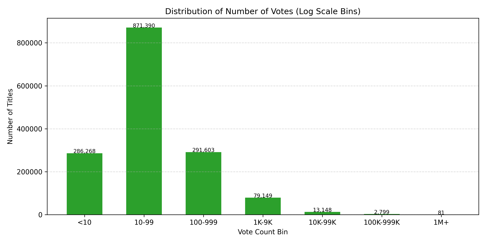
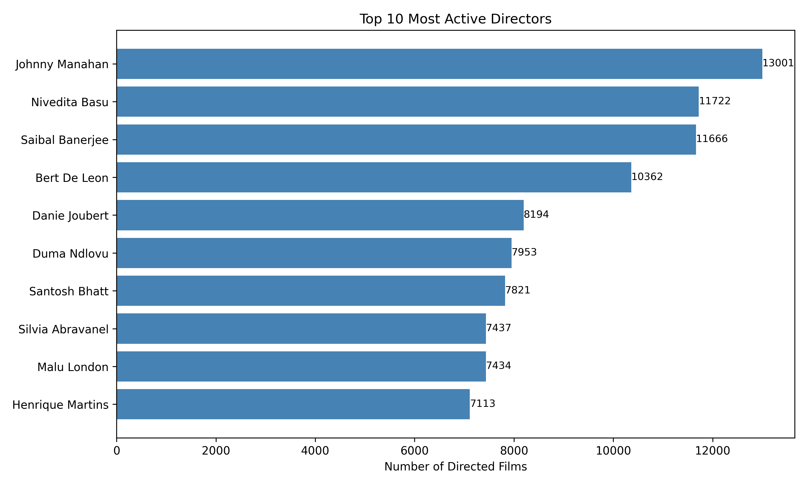
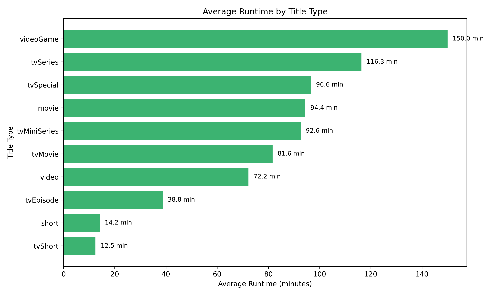

# Success Factors of Movies on IMDb

&nbsp; 
## 🚀 Introduction: Unveiling the Drivers of Film Popularity on IMDb

In the dynamic world of cinema, where content creation is booming, understanding what truly captivates audiences is paramount for industry players. This **personal project** delves into publicly available IMDb datasets to uncover the **key factors that influence viewer recognition and film popularity**. My goal is to understand how elements like genres, runtime, and—critically—the contributions of specific directors and actors shape how audiences perceive a film, and how these preferences have evolved over time.

While this project does not aim to predict box office revenue or commercial success (as it relies solely on publicly accessible IMDb data without financial information), its focus is on **analyzing critical and audience reception** – specifically, average ratings and vote counts. This analysis provides valuable insights into content strategy, talent acquisition, and audience engagement, crucial for **production companies, streaming platforms, and talent agencies** striving to connect with viewers. I undertook this project to **deepen my skills in large-scale data querying with SQL (Google BigQuery), data manipulation with Python/Pandas, and effective data visualization**, demonstrating how analytical insights can inform strategic decisions in the entertainment industry.
&nbsp; 

## ❓ Key Research Questions

In this project, I aim to answer the following questions using IMDb data, defining **"success" by a film's average rating and total vote count on IMDb**:

* **What defines a “successful” film in terms of audience ratings and overall popularity on IMDb?** (This question serves as a foundation for understanding our key metrics.)
  
* **How are genres and keywords related to a film’s ratings and popularity?**
  
* **How have ratings, popularity, and genre preferences in the film industry evolved over time?**
  
* **Which directors and actors (based on their specific roles) are consistently associated with highly rated and popular films?**
  
* **How does a film’s runtime affect its average rating and number of votes?**
&nbsp;

 ## Data Sources
The analysis is based on IMDb data files manually downloaded from the official [IMDb datasets](https://datasets.imdbws.com/) page and then uploaded to Google BigQuery for querying. 
The following tables were created from the corresponding TSV files:

  - **IMDb_dataset.title_basics → title.basics.tsv**
    
Contains metadata about titles, including type (movie, short, TV episode), primary title, original title, start/end year, runtime, and genres.

  - **IMDb_dataset.title_ratings → title.ratings.tsv**
    
Includes the average IMDb rating and the number of votes each title has received

  - **IMDb_dataset.title_principals → title.principals.tsv**
    
Maps titles to their main cast and crew (actors, actresses, directors, etc.), including their role categories and order of appearance.

  - **IMDb_dataset.name → name.basics.tsv**
    
rovides information about individuals (e.g. actors, directors), including their birth/death years and known titles.

  - **IMDb_dataset.title_crew → title.crew.tsv**
    
 Contains directors and writers for each title, often stored as comma-separated IDs.

**Data Preparation: Making the Data Clean and Analysis-Ready**

High-quality analysis starts with clean data. Before diving into the exploration, I completed the following data preparation steps (the full code and process details are available in [cleaning_scripts](./cleaning_scripts)):

- **Data merging:** The original TSV files were converted to CSV and merged using the common movie identifier (`tconst`) to form a unified dataset for analysis (specifically, **title_ratings** and **title_basics** tables).

- **Handling missing values:** Missing data in key columns (`averageRating`, `numVotes`, `genres`, `runtimeMinutes`, `startYear`) was processed —primarily by removing incomplete rows or imputing values logically—to ensure accurate calculations.

- **Data type conversion:** Columns such as `startYear`, `runtimeMinutes`, `averageRating`, and `numVotes` were cast to appropriate numeric formats.

- **Parsing categorical data:** Genre values, as well as director and actor identifiers (stored as comma-separated strings), were parsed—often within **SQL queries** —for entity-level analysis.

 &nbsp; 
## Tools & Technologies
  - **Google BigQuery** for SQL querying large datasets

  - **Python** for data analysis and visualization

  - **Libraries:** pandas, matplotlib, seaborn, numpy, scipy

&nbsp; 
## 📈 Analysis & Insights: What Do the Numbers Say?
Now that the data is prepared, let’s dive into it and uncover patterns that address our key research questions.

**1. General Overview of Success and Production Volume**

We begin with a broad look at the distribution of our key success metrics and the overall volume of content production.

- **Content Production Dynamics:**

    - **Insight:** The film industry has experienced exponential growth over the past few decades, especially since the 1990s. This surge is primarily driven by the massive volume of TV episodes, which now make up the overwhelming majority of entries in the IMDb database—far surpassing feature films and short films.

- **Rating and Popularity Distribution:**
    - **Insight:** The distribution of average movie ratings indicates that most films fall within the **6.5 to 8.0** range, with a peak around **7.5**. This reflects a general trend toward "good but not outstanding" scores.
When it comes to popularity, most films receive a **relatively low number of votes** (up to 99), while only a small share exceeds **1,000 votes**, and just a few surpass **1 million votes**. This confirms that despite the vast number of movies, only a small percentage achieve extremely high audience engagement.

**2. How are genres related to a film’s ratings and popularity?**

Which themes and categories resonate most with audiences?

- **Genre Popularity by Content Type:**

    - **Insight:** Drama, Comedy, and Documentary remain the most common genres across both movies and TV series. However, Reality TV and Talk Shows are almost entirely exclusive to serial formats, while Action, Romance, and Thriller are significantly more frequent in feature films.

  
- **Top-Rated Genres:**

    - **Insight:** Genres such as Biography, Animation, and Drama consistently receive high viewer ratings, possibly due to their ability to evoke deep emotions and deliver quality storytelling.
  

- **Relationship Between Rating and Popularity:**

    - **Insight:** There is a moderate positive correlation (r ≈ 0.63) between the number of votes and a film’s average rating. This suggests that more popular films tend to have slightly higher ratings. However, a high number of votes does not necessarily guarantee a high rating.

**3. Film Industry Dynamics: Trends Over Time**

How have ratings, popularity, and genre preferences evolved in cinema over the years?

- **Genre Rating Trends by Decade:**

    - **Insight:** All genres show a general upward trend in ratings over time, especially between 1940 and 2000. Documentaries and Dramas demonstrate the most stable growth.

- **Evolution of Genre Popularity:**

    - **Insight:** Over time, there have been significant shifts in genre shares. For example, the share of **Drama** and **Comedy* has remained relatively stable, while **Action** and **Animation** have shown growing popularity, especially since the 1980s. This may reflect changes in production capabilities, audience preferences, and technological advancements that enable the creation of more complex visual effects.

**4. Impact of Directors and Actors: Who Drives Success?**

How significant is the role of key creators (directors, actors) in achieving high ratings and broad popularity?

- **Influence of “Famous” Directors:**

    - **Insight:** Directors with a large number of popular works tend to have significantly higher average ratings (7.31) compared to others (6.68). This suggests that experience and reputation are correlated with the overall perception of their films.
      

- **Actors as Genre Icons:**

    - **Insight:** Some actors become synonymous with certain genres and consistently appear in highly rated or popular projects within those genres. For example, Robert De Niro leads in the number of roles in drama films.
      

- **Most Productive Creators:**

  - **Insight:** The analysis shows that the most prolific directors, such as **Johnny Manahan** (over 13,000 films) and **Nivedita Basu** (over 11,000 films), as well as actors like **Mohanlal** (280+ appearances), often work in high-volume content formats such as TV series, where each episode is counted as a separate film. This highlights their significant role in continuous content production, but does not always directly correlate with their average ratings, as their extensive filmographies may include both highly rated and less prominent works.

- **Top-Rated Directors:**
  - **Insight:** Unlike productivity, a high average rating reflects the consistent quality of a director’s work as valued by audiences. Directors such as **Tomohisa Taguchi**, **Barth Maunoury**, and **Shouta Goshozono** top this list with average ratings above **9.2**, significantly exceeding the overall mean. This indicates that these directors are capable of creating films that are not only popular, but also receive deep and lasting audience appreciation. Their works often set a benchmark for quality within their genres.

**5. Analysis of Film Duration Impact**

How does a film's duration (`runtimeMinutes`) affect its average rating and number of votes?

- **Insight on Typical Runtimes:** Content duration varies significantly depending on its type. For example, video games and feature films tend to have the highest average runtimes, while TV episodes and short films are considerably shorter.

- **Runtime’s Impact on Ratings**

The analysis shows that films with an average runtime between **60 and 90 minutes** tend to achieve **higher average ratings**. Ratings decline for titles that are either **too short (less than 60 minutes)** or **too long (over 150–180 minutes)**. This may indicate the existence of an optimal runtime that keeps viewers engaged.

- **Runtime’s Impact on Popularity**

When it comes to popularity (measured by the number of votes), there's a noticeable trend: films with **average to slightly above-average runtimes (approximately 120 to 170 minutes)** tend to receive the **highest number of votes**. Extremely short or very long films generally attract a smaller audience, which is reflected in a lower number of votes.

&nbsp; 

## 💡 **Conclusions and Recommendations: What Did We Learn?**

This analysis uncovered several key factors influencing audience recognition of films and allowed us to formulate practical recommendations based on them.

**Key Insights:**

- **Production Volume:** The film and TV industry is experiencing unprecedented growth, especially driven by TV episodes, highlighting the need for new strategies to capture audience attention.

- **Genre Preferences:** Drama, Comedy, and Documentary remain universally popular, while Biography and Animation genres consistently receive high ratings.

- **Impact of Creators:** Involving experienced and well-known directors and actors statistically correlates with higher ratings and broader popularity, confirming their role as "quality guarantors."

- **Correlation Between Quality and Popularity:** High ratings often lead to widespread popularity—but not always the other way around—emphasizing the importance of focused, high-quality content creation.

### 🎯 Recommendations

#### For Production Companies:

- **Strategic Genre Planning:** Consider not only overall popularity but also the high-rating potential of certain genres (e.g., Biography, Animation) to maximize audience satisfaction.

- **Attracting "Stars":** Invest in collaboration with directors and actors who have a proven track record of high ratings and audience engagement.

- **Duration Optimization:** Analyze the optimal runtime of films for your target audience in order to maximize viewer recognition and satisfaction.

#### For Streaming Platforms:

- **Content Curation:** Use data on successful genres, trends, and creator involvement to shape curated collections and personalized recommendations.

- **Acquisition/Production Strategy:** Focus on acquiring or producing content aligned with identified growth trends and the characteristics of highly rated films.

### **🚀 Future Steps and Potential Enhancements**
This analysis provides a solid foundation for understanding the factors influencing film success. Future enhancements could include:

* **Deepening the Impact of Directors and Actors:** Incorporate more sophisticated **network analysis** to understand collaboration patterns and their impact on film success. This could involve analyzing clusters of successful collaborators.
  
* **Expanding Data Sources for a Holistic View:** Integrate additional data sources such as **box office performance, marketing spend, and critical reviews from other platforms** (e.g., Rotten Tomatoes, Metacritic) to develop a more comprehensive definition of "success" beyond IMDb ratings and votes. This would allow for financial success analysis.
  
* **Developing Predictive Machine Learning Models:** Build **predictive models** to assess the potential rating or popularity of a new film based on its characteristics (genre, runtime, key cast/crew, etc.). This could involve exploring **regression models (e.g., Linear Regression, Random Forest Regressor)** for rating prediction and **classification models (e.g., Logistic Regression, Support Vector Machines)** for popularity categories (e.g., "high vote count" vs. "low vote count").
